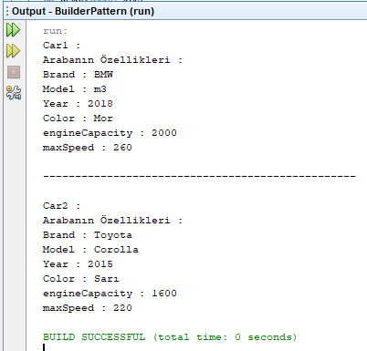

=== [black]#UML#

.BuilderPattern UML
[uml,file="umlClass.png"]
----
left to right direction

class Car{
-String Brand
-String Model
-String Color
-int Year
-int engineCapacity
-int maxSpeed
+void Brand()
+void Model()
+void Color()
+void Year()
+void engineCapacity()
+void maxSpeed()
+String write()
}

interface Builder{
+void buildBrand()
+void buildModel()
+void buildColor()
+void buildYear()
+void buildengineCapacity()
+void buildmaxSpeed()
+Car getCar()
}

class BMW{
-Car car
+BMW()
}

class Toyota{
-Car car
+Toyota()
}

class Galery{
-Builder builder
+Galery()
+Car getCar()
+void buildCar()
}

class BuilderPattern{
+{static} void main()
}

Toyota ..|> Builder
BMW ..|> Builder
Galery ..> Builder : <<use>>
Builder --> Car : <<use>>
BuilderPattern ..> Builder : <<use>>

----

.Car.java
[source,java]
----

package builderpattern;

class Car {

    private String Brand;
    private String Model;
    private int Year;
    private String Color;
    private int engineCapacity;
    private int maxSpeed;

    public void Brand(String Brand) {
        this.Brand = Brand;
    }

    public void Model(String Model) {
        this.Model = Model;
    }

    public void Year(int Year) {
        this.Year = Year;
    }

    public void Color(String Color) {
        this.Color = Color;
    }

    public void engineCapacity(int engineCapacity) {
        this.engineCapacity = engineCapacity;
    }

    public void maxSpeed(int maxSpeed) {
        this.maxSpeed = maxSpeed;
    }

    public String write() {
        String write = "Arabanın Özellikleri : \n";

        write += "Brand : ";
        write += this.Brand;
        write += "\n";
        write += "Model : ";
        write += this.Model;
        write += "\n";
        write += "Year : ";
        write += this.Year;
        write += "\n";
        write += "Color : ";
        write += this.Color;
        write += "\n";
        write += "engineCapacity : ";
        write += this.engineCapacity;
        write += "\n";
        write += "maxSpeed : ";
        write += this.maxSpeed;
        write += "\n";

        return write;
    }
}

----

.Builder.java
[source,java]
----

package builderpattern;

interface Builder {

    public void buildBrand();

    public void buildModel();

    public void buildYear();

    public void buildColor();

    public void buildengineCapacity();

    public void buildmaxSpeed();

    public Car getCar();
}

----

.BMW.java
[source,java]
----

package builderpattern;

class BMW implements Builder {

    private Car car;

    public BMW() {
        car = new Car();
    }

    @Override
    public void buildBrand() {
        car.Brand("BMW");
    }

    @Override
    public void buildModel() {
        car.Model("m3");
    }

    @Override
    public void buildYear() {
        car.Year(2018);
    }

    @Override
    public void buildColor() {
        car.Color("Kırmızı");
    }

    @Override
    public void buildengineCapacity() {
        car.engineCapacity(2000);
    }

    @Override
    public void buildmaxSpeed() {
        car.maxSpeed(260);
    }

    @Override
    public Car getCar() {
        return this.car;
    }

}

----

.Toyota.java
[source,java]
----

package builderpattern;

class Toyota implements Builder {

    private Car car;

    public Toyota() {
        car = new Car();
    }

    @Override
    public void buildBrand() {
        car.Brand("Toyota");
    }

    @Override
    public void buildModel() {
        car.Model("Corolla");
    }

    @Override
    public void buildYear() {
        car.Year(2015);
    }

    @Override
    public void buildColor() {
        car.Color("Mavi");
    }

    @Override
    public void buildengineCapacity() {
        car.engineCapacity(1600);
    }

    @Override
    public void buildmaxSpeed() {
        car.maxSpeed(220);
    }

    @Override
    public Car getCar() {
        return this.car;
    }

}

----

.Galery.java
[source,java]
----

package builderpattern;

class Galery {

    private Builder builder;

    public Galery(Builder builder) {
        this.builder = builder;
    }

    public Car getCar() {
        return builder.getCar();
    }
    
    public void buildCar(){
        builder.buildBrand();
        builder.buildModel();
        builder.buildYear();
        builder.buildColor();
        builder.buildengineCapacity();
        builder.buildmaxSpeed();
    }
}

----

.BuilderPattern.java
[source,java]
----

package builderpattern;

public class BuilderPattern {

    public static void main(String[] args) {
        Builder BMW = new BMW();
        Builder Toyota = new Toyota();
        
        Galery one = new Galery(BMW);
        Galery two = new Galery(Toyota);
        
        one.buildCar();
        Car car1 = one.getCar();
        System.out.println("Car1 :");
        car1.Color("Mor");
        System.out.println(car1.write());
        
        System.out.println("-------------------------------------------------");
        System.out.println("");
        
        two.buildCar();
        Car car2 = two.getCar();
        System.out.println("Car2 :");
        car2.Color("Sarı");
        System.out.println(car2.write());
    }
}

----

=== [black]#Çıktı#

