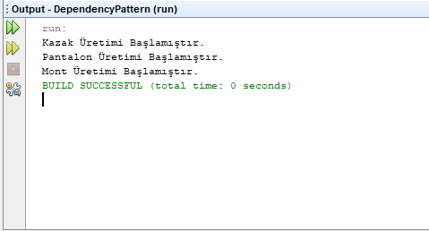

= [black]#DEPENDENCY INVERSION PRINCIPLE TASARIM DESENİ#

[gray]#Onur Kaplan - 160202061#

Dependency inversion principle pattern bağımlılıkların yönetimiyle ilgili bir patterndir. Bağımlılığın türleri vardır. Loosely Coupled (Gevşek Bağımlılık) Sınıfların birbirleriyle olan bağlantılarının az olduğu sistemlerdir.Tightly Coupled(Sıkı Bağımlılık) Bir nesnenin çalışmak için diğer nesnelere ihtiyaç duyduğu sistemlerdir. Dependency inversion principle patternde amacımız bağımlılığı azaltmaya çalışmaktır. Çünkü birbirine bağımlı sınıfları olan sistemlere yeni eklemeler yapmak zor olacaktır. Dependency inversion principle patternde nesneye doğrudam ulaşmak yerine modüler olarak ulaşılmaya çalışılır.

Bu ilkenin genel fikri önemli olduğu kadar basittir. Karmaşık mantık sağlayan yüksek seviyeli modüller, yeniden kullanılabilir olmalı ve yardımcı özellikler sağlayan düşük seviyeli modüllerdeki değişikliklerden etkilenmemelidir. Bunu başarmak için, yüksek seviyeli ve düşük seviyeli modülleri birbirinden ayıran bir soyutlama getirmeniz gerekir.

Örnek uygulamada bir kıyafet üretim fabrikasının sistemini oluşturdum. Şuan da hangi tür kıyafetlerin üretileceği kesin olmadığı gibi daha sonra da üretime eklenicek kıyafet türlerinin de kolayca eklenebilmesi için dependency inversion principle tasarım desenini tercih ettim.

=== [black]#UML#

.Dependency Inversion Principle Pattern UML
[uml,file="umlClass1.png"]
----

interface KıyafetÜret {
public void üret()
}

class Mont{
}

class Pantolon{
}

class Kazak{
}

class İmalat{
-KıyafetÜret kıyafet
+İmalat()
+void Yap()
}

Class DependencyPattern{
+{static} void main()
}

Kazak ..|> KıyafetÜret
Pantolon ..|> KıyafetÜret
Mont ..|> KıyafetÜret
İmalat ..> KıyafetÜret : <<use>>
DependencyPattern ..> KıyafetÜret : <<use>>

----

.DependencyPattern.java
[source,java]
----
public class DependencyPattern {

    public static void main(String[] args) {
        İmalat kazak = new İmalat(new Kazak());
        kazak.Yap();
        
        İmalat pantalon = new İmalat(new Pantalon());
        pantalon.Yap();
        
        İmalat mont = new İmalat(new Mont());
        mont.Yap();
    }
    
}
----

.KıyafetÜret.java
[source,java]
----
package dependencypattern;

public interface KıyafetÜret {
    public void üret();
}
----

.Kazak.java
[source,java]
----
package dependencypattern;

public class Kazak implements KıyafetÜret{

    @Override
    public void üret() {
        System.out.println("Kazak Üretimi Başlamıştır.");
    }
    
}
----

.Mont.java
[source,java]
----
package dependencypattern;

public class Mont implements KıyafetÜret{

    @Override
    public void üret() {
        System.out.println("Mont Üretimi Başlamıştır.");
    }
    
}
----

.Pantolon.java
[source,java]
----
package dependencypattern;

public class Pantolon implements KıyafetÜret{

    @Override
    public void üret() {
        System.out.println("Pantolon Üretimi Başlamıştır.");
    }
    
}
----

.İmalat.java
[source,java]
----
package dependencypattern;

public class İmalat {
    KıyafetÜret kıyafet;

    İmalat(KıyafetÜret kıyafet) { <1>
        this.kıyafet = kıyafet;
    }
    
    public void Yap(){
        kıyafet.üret();
    }
}
----

<1> Gönderilen nesnenin referansı alınarak o nesne için üret() methodu çağırılır.

=== [black]#SONUÇLAR#

İmalat sınıfının içine Kazak,Pantolon ve Mont Nesnelerini göndererek Yap() methodu ile üretimleri başlatılmıştır.

