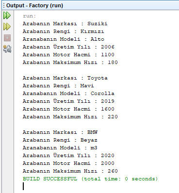

=== [black]#UML#

.FactoryPattern UML
[uml,file="umlClass1.png"]
----

package Arabalar{

interface Araba
{
+void Brand()
+void Model()
+void Year()
+void Color()
+void engineCapacity()
+void maxSpeed()
}

class Suzuki{
}

class Toyota{
}

class BMW{
}

}

class ArabaFactory{
+Araba createAraba()
}

class Factory{
-Suzuki suzuki
-Toyota toyoya
-BMW bmw
+void main()
}

Suzuki ..|> Araba
Toyota ..|> Araba
BMW ..|> Araba
ArabaFactory --> Araba : <<use>>
Factory --> ArabaFactory : <<use>>

----

.Factory.java
[source,java]
----

package factory;

public class Factory {

     public interface Araba {

        void Brand();

        void Model(String model);

        void Year(int year);

        void Color(String color);

        void engineCapacity(int capacity);

        void maxSpeed(int speed);

    }

    public static class Suzuki implements Araba {

        @Override
        public void Brand() {
            System.out.println("Arabanın Markası : Suziki ");
        }

        @Override
        public void Model(String model) {
            System.out.println("Aranabanın Modeli : " + model);
        }

        @Override
        public void Year(int year) {
            System.out.println("Arabanın Üretim Yılı : " + year);
        }

        @Override
        public void Color(String color) {
            System.out.println("Arabanın Rengi : " + color);
        }

        @Override
        public void engineCapacity(int capacity) {
            System.out.println("Arabanın Motor Hacmi : " + capacity);
        }

        @Override
        public void maxSpeed(int speed) {
            System.out.println("Arabanın Maksimum Hızı : " + speed);
        }

    }

    public static class Toyota implements Araba {

        @Override
        public void Brand() {
            System.out.println("Arabanın Markası : Toyota");
        }

        @Override
        public void Model(String model) {
            System.out.println("Aranabanın Modeli : " + model);
        }

        @Override
        public void Year(int year) {
            System.out.println("Arabanın Üretim Yılı : " + year);
        }

        @Override
        public void Color(String color) {
            System.out.println("Arabanın Rengi : " + color);
        }

        @Override
        public void engineCapacity(int capacity) {
            System.out.println("Arabanın Motor Hacmi : " + capacity);
        }

        @Override
        public void maxSpeed(int speed) {
            System.out.println("Arabanın Maksimum Hızı : " + speed);
        }

    }

    public static class BMW implements Araba {

        @Override
        public void Brand() {
            System.out.println("Arabanın Markası : BMW");
        }

        @Override
        public void Model(String model) {
            System.out.println("Aranabanın Modeli : " + model);
        }

        @Override
        public void Year(int year) {
            System.out.println("Arabanın Üretim Yılı : " + year);
        }

        @Override
        public void Color(String color) {
            System.out.println("Arabanın Rengi : " + color);
        }

        @Override
        public void engineCapacity(int capacity) {
            System.out.println("Arabanın Motor Hacmi : " + capacity);
        }

        @Override
        public void maxSpeed(int speed) {
            System.out.println("Arabanın Maksimum Hızı : " + speed);
        }

    }

    public static class ArabaFactory {

        public static Araba createAraba(Class araba) throws IllegalAccessException, InstantiationException {
            return (Araba) araba.newInstance();
        }
    }
    
    public static void main(String[] args) {
        try {
            Suzuki suzuki = (Suzuki) ArabaFactory.createAraba(Suzuki.class);
            suzuki.Brand();
            suzuki.Color("Kırmızı");
            suzuki.Model("Alto");
            suzuki.Year(2006);
            suzuki.engineCapacity(1100);
            suzuki.maxSpeed(180);
            
            System.out.println("");
            
            Toyota toyota = (Toyota) ArabaFactory.createAraba(Toyota.class);
            toyota.Brand();
            toyota.Color("Mavi");
            toyota.Model("Corolla");
            toyota.Year(2019);
            toyota.engineCapacity(1600);
            toyota.maxSpeed(220);
            
            System.out.println("");
            
            BMW bmw = (BMW) ArabaFactory.createAraba(BMW.class);
            bmw.Brand();
            bmw.Color("Beyaz");
            bmw.Model("m3");
            bmw.Year(2020);
            bmw.engineCapacity(2000);
            bmw.maxSpeed(260);
            
          
        } catch (Exception e) {
            e.printStackTrace();
        }
    }
    
}

----

=== [black]#Çıktı#

