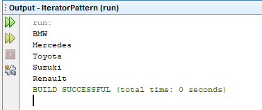

=== [black]#UML#

.IteratorPattern UML
[uml,file="umlClass.png"]
----

Class ArabaMarkaları{
-String name
+ArabaMarkaları()
+String getName()
+void setName()
}

interface Iterator{
+void reset()
+E next()
+E currentItem()
+boolean hasNext()
}

Class ArabaMarkalarıIterator{
-ArabaMarkaları[] arabalar
-int position
+ArabaMarkalarıIterator()
}

interface List{
+Iterator<E> iterator()
}

Class ArabaMarkalarıList{
-ArabaMarkaları[] arabalar
+ArabaMarkalarıList()
}

Class thread{
Iterator<ArabaMarkaları> iterator
+thread()
+void run()
}

Class IteratorPattern{
+{static} void main()
}

ArabaMarkalarıIterator ..|> Iterator
ArabaMarkalarıList ..|> List
ArabaMarkalarıList --> ArabaMarkalarıIterator : <<use>>
IteratorPattern --> thread : <<use>>
thread --> ArabaMarkalarıList : <<use>>
ArabaMarkalarıList  -->  ArabaMarkaları : <<use>>
ArabaMarkalarıIterator -->  ArabaMarkaları : <<use>>
----

.IteratorPattern.java
[source,java]
----

package ıteratorpattern;

public class IteratorPattern {

    public static void main(String[] args) {
        ArabaMarkaları[] arabalar = new ArabaMarkaları[5];
        arabalar[0] = new ArabaMarkaları("BMW");
        arabalar[1] = new ArabaMarkaları("Mercedes");
        arabalar[2] = new ArabaMarkaları("Toyota");
        arabalar[3] = new ArabaMarkaları("Suzuki");
        arabalar[4] = new ArabaMarkaları("Renault");

        List<ArabaMarkaları> list = new ArabaMarkalarıList(arabalar);

        Iterator<ArabaMarkaları> iterator = list.iterator();

        thread thread = new thread(iterator);
        thread.start();
    }

}

----

.Iterator.java
[source,java]
----

package ıteratorpattern;

public interface Iterator<E> {

    void reset();

    E next();

    E currentItem();

    boolean hasNext();
}

----

.List.java
[source,java]
----

package ıteratorpattern;

public interface List<E> {

    Iterator<E> iterator();
}

----

.thread.java
[source,java]
----

package ıteratorpattern;

public class thread extends Thread {

    Iterator<ArabaMarkaları> iterator;

    thread(Iterator<ArabaMarkaları> iterator) {
        this.iterator = iterator;
    }

    @Override
    public void run() {
        while (iterator.hasNext()) {
            ArabaMarkaları currentTopic = iterator.next();
            System.out.println(currentTopic.getName());
        }

    }

}

----

.ArabaMarkalarıList.java
[source,java]
----

package ıteratorpattern;

public class ArabaMarkalarıList implements List<ArabaMarkaları> {

    private ArabaMarkaları[] arabalar;

    public ArabaMarkalarıList(ArabaMarkaları[] arabalar) {
        this.arabalar = arabalar;
    }

    @Override
    public Iterator<ArabaMarkaları> iterator() {
        return new ArabaMarkalarıIterator(arabalar);
    }
}

----

.ArabaMarkaları.java
[source,java]
----

package ıteratorpattern;

public class ArabaMarkaları {

    private String name;

    public ArabaMarkaları(String name) {
        super();
        this.name = name;
    }

    public String getName() {
        return name;
    }

    public void setName(String name) {
        this.name = name;
    }
}

----

.ArabaMarkalarıIterator.java
[source,java]
----

package ıteratorpattern;

public class ArabaMarkalarıIterator implements Iterator<ArabaMarkaları> {

    private ArabaMarkaları[] arabalar;
    private int position;

    public ArabaMarkalarıIterator(ArabaMarkaları[] arabalar) {
        this.arabalar = arabalar;
        position = 0;
    }

    @Override
    public void reset() {
        position = 0;
    }

    @Override
    public ArabaMarkaları next() {
        return arabalar[position++];
    }

    @Override
    public ArabaMarkaları currentItem() {
        return arabalar[position];
    }

    @Override
    public boolean hasNext() {
        if (position >= arabalar.length) {
            return false;
        }
        return true;
    }
}

----

=== [black]#Çıktı#

