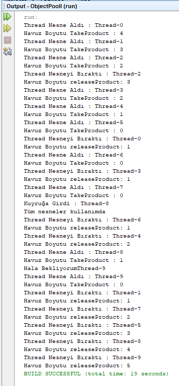

=== [black]#UML#

.ObjectPool UML
[uml,file="umlClass1.png"]
----
class thread{
-Nesne nesne
-ObjectPooll objectPool
-Boolean THflag
+thread()
+void run()
}

class ObjectPooll{
+{static} int buyukluk
-{static}Stack<Nesne> havuz
-{static}ObjectPooll instance
+boolean flag
-ObjectPooll()
+{static} ObjectPooll getInstance()
+Nesne nesneAl()
+void yazdır()
+void nesneyiBırak()
+{static} void main()
}

class Nesne{
+void yaz()
}

ObjectPooll --> thread : <<use>>
ObjectPooll --> Nesne : <<use>>
----

.thread.java
[source,java]
----

package objectpooll;

import java.util.ArrayList;
import java.util.Stack;

class thread extends Thread {

    private Nesne nesne;
    private ObjectPooll objectPool;
    private Boolean THflag;

    public thread(ObjectPooll objectPool, Nesne nesne) {
        this.objectPool = objectPool;
        this.nesne = nesne;
        this.THflag = false;
    }

    @Override
    public void run() {
        while (!THflag) {
            if (objectPool.flag) {
                System.out.println("Tüm nesneler kullanımda");
                while (objectPool.flag) {                    
                    try {                        
                        Thread.sleep((long) (Math.random() * 3000));
                        System.out.println("Hala Bekliyorum"+this.getName());
                    } catch (InterruptedException e) {
                        e.printStackTrace();
                    }
                }
            } else {
                nesne = objectPool.nesneAl(this);
                
                try {
                    Thread.sleep((long) (Math.random() * 10000));
                } catch (InterruptedException e) {
                    e.printStackTrace();
                }
                if (nesne != null) {
                    objectPool.nesneyiBırak(nesne,this);
                    THflag = true;
                }
                
                //objectPool.lenPool();
            }

        }
    }
}

----

.Nesne.java
[source,java]
----

package objectpooll;

import java.util.ArrayList;
import java.util.Stack;

class Nesne {

    public void yaz() {
        System.out.println("Nesne");
    }
}

----

.ObjectPooll.java
[source,java]
----

package objectpooll;

import java.util.ArrayList;
import java.util.Stack;

public class ObjectPooll {

    //public static ArrayList<thread> fazlalıklar = new ArrayList<thread>();
    public static final int buyukluk = 5;
    //private int sayac = 0;
    private static Stack<Nesne> havuz;
    private static ObjectPooll instance;
    public boolean flag = false;

    private ObjectPooll() {
        havuz = new Stack<Nesne>();
    }

    public static ObjectPooll getInstance() {

        if (instance == null) {
            synchronized (ObjectPooll.class) {
                if (instance == null) {
                    instance = new ObjectPooll();
                }
            }
        }
        return instance;
    }

     synchronized Nesne nesneAl(thread th) {
        if (havuz.size() > 0) {
            System.out.println("Thread Nesne Aldı : " + th.getName());
            System.out.println("Havuz Boyutu TakeProduct : " + (havuz.size()-1));

            flag = false;
            return this.havuz.pop();

        } else {
            System.out.println("Kuyruğa Girdi : " + th.getName());
            flag = true;   
            // fazlalıklar.add(th);
            return null;
        }
    }

    void yazdır() {
        System.out.println(havuz.size());
    }

    synchronized void nesneyiBırak(Nesne p,thread th) {
        havuz.add(p);
        flag = false;
        System.out.println("Thread Nesneyi Bıraktı : " + th.getName());
        System.out.println("Havuz Boyutu releaseProduct: " + havuz.size());
    }

    public static void main(String[] args) {
        ObjectPooll pool = ObjectPooll.getInstance();

        for (int i = 0; i < buyukluk; i++) {
            Nesne p = new Nesne();
            havuz.add(p);
        }
        
        Nesne product = null; // = pool.takeProduct();

        for (int i = 0; i < 15; i++) {
            thread deneme = new thread(pool, product);
            deneme.start();
            try {
                Thread.sleep(1000);
            } catch (InterruptedException e) {
                e.printStackTrace();
            }
        }

    }
}

----

=== [black]#Çıktı#

