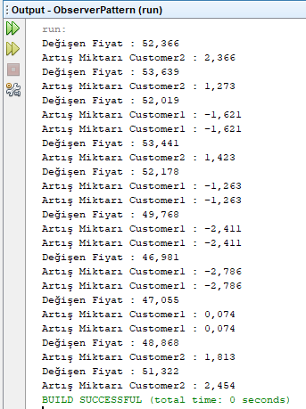

=== [black]#UML#

.ObserverPattern UML
[uml,file="umlClass2.png"]
----
left to right direction

Class ObserverPattern{
+{static} void main()
}

interface bourseSubject {
+void addObserver()
+void removeObserver()
+void doNotify()
}

Class pegasusCustomer1{
}

Class pegasusCustomer2{
}

interface pegasusObserver {
+void update()
}

Class pegasusStatus{
-List<pegasusObserver> pegasusList
-double price
-double change
-double hold
+pegasusStatus()
+void setPrice()
}

Class thread{
pegasusStatus pegasus
+thread()
+void run()
}

pegasusStatus ..|> bourseSubject
pegasusCustomer1 ..|> pegasusObserver
pegasusCustomer2 ..|> pegasusObserver
pegasusStatus --> pegasusObserver : <<use>>
ObserverPattern --> thread : <<use>>
thread --> pegasusStatus : <<use>>
----

.ObserverPattern.java
[source,java]
----

package observerpattern;

public class ObserverPattern {

    public static void main(String[] args) {
        pegasusStatus pegasus = new pegasusStatus(50);
        pegasusCustomer1 pc1 = new pegasusCustomer1();
        pegasusCustomer1 pc2 = new pegasusCustomer1();
        pegasusCustomer2 pc3 = new pegasusCustomer2();
        
        pegasus.addObserver(pc1);
        pegasus.addObserver(pc2);
        pegasus.addObserver(pc3);
        
        thread thread = new thread(pegasus);
        thread.start();

    }
    
}

----

.bourseSubject.java
[source,java]
----

package observerpattern;

public interface bourseSubject {
    public void addObserver(pegasusObserver observer);
    public void removeObserver(pegasusObserver observer);
    public void doNotify();
}

----

.pegasusCustomer1.java
[source,java]
----

package observerpattern;

import java.text.DecimalFormat;

public class pegasusCustomer1 implements pegasusObserver{
    DecimalFormat df = new DecimalFormat("#.###");
    @Override
    public void update(double change) {
        if(change < 0.35){
            System.out.println("Artış Miktarı Customer1 : " +df.format(change));
        }
    }
    
}

----

.pegasusCustomer2.java
[source,java]
----

package observerpattern;

import java.text.DecimalFormat;

public class pegasusCustomer2 implements pegasusObserver{
    DecimalFormat df = new DecimalFormat("#.###");
    @Override
    public void update(double change) {
        if(change > 0.35){
            System.out.println("Artış Miktarı Customer2 : " +df.format(change));
        }
    }
    
}

----

.pegasusObserver.java
[source,java]
----

package observerpattern;

public interface pegasusObserver {
    void update(double change);   
}

----

.pegasusStatus.java
[source,java]
----

package observerpattern;

import java.util.ArrayList;
import java.util.List;

public class pegasusStatus implements bourseSubject{
    private List<pegasusObserver> pegasusList;
    private double price;
    private double change;
    private double hold;

    public pegasusStatus(double price) {
        pegasusList = new ArrayList<>();
        this.price = price;
    }    
    
    public void setPrice(double price) {
        hold = this.price;
        this.price = price;
        change = price-hold;
        doNotify();
    }
    
    @Override
    public void addObserver(pegasusObserver observer) {
       pegasusList.add(observer);
    }

    @Override
    public void removeObserver(pegasusObserver observer) {
        pegasusList.remove(observer);
    }

    @Override
    public void doNotify() {
        for (pegasusObserver observer : pegasusList) {
            observer.update(change);
        }
    }
        
}

----

.thread.java
[source,java]
----

package observerpattern;

import java.text.DecimalFormat;

public class thread extends Thread {

    DecimalFormat df = new DecimalFormat("#.###");
    pegasusStatus pegasus;

    thread(pegasusStatus pegasus) {
        this.pegasus = pegasus;
    }

    @Override
    public void run() {
        double price = 50;
        double change;
        for (int i = 0; i < 10; i++) {
            change = ((Math.random()*10)-5)%3;
            price = price+change;
            System.out.println("Değişen Fiyat : " +df.format(price));
            pegasus.setPrice(price);
        }
    }
    
}

----

=== [black]#Çıktı#

