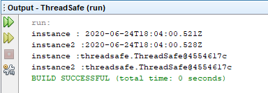

=== [black]#UML#

.Singleton UML
[uml,file="umlClass2.png"]
----

class ThreadSafe{
-ThreadSafe instance
-ThreadSafe()
+ThreadSafe getInstance()
+ZonedDateTime getUTCDateTime()
}

ThreadSafe --> ThreadSafe

----

.ThreadSafe.java
[source,java]
----

package threadsafe;

import java.time.ZoneOffset;
import java.time.ZonedDateTime;

public class ThreadSafe {

    private static ThreadSafe instance;

    private ThreadSafe() {

    }

    public static ThreadSafe getInstance() {
        if (instance == null) { <1>
            synchronized (ThreadSafe.class) { 

                if (instance == null) { <2>
                    instance = new ThreadSafe();
                }
            }
        }
        return instance;
    }

    public ZonedDateTime getUTCDateTime() {
        ZonedDateTime now = ZonedDateTime.now(ZoneOffset.UTC);
        return now;
    }

    public static void main(String[] args) {
        ThreadSafe instance = ThreadSafe.getInstance();
        System.out.println("instance : "+instance.getUTCDateTime());
        
        ThreadSafe instance2 = ThreadSafe.getInstance();
        System.out.println("instance2 :"+instance.getUTCDateTime());
        
        System.out.println("instance :"+instance);
        System.out.println("instance2 :"+instance2);
    }

}

----
<1> Obje daha önce oluşturulmuşsa yeni gelen thread'in synchronized bölümüne girmesini engeller.
<2> Obje daha önce oluşturulmuşsa yeni objenin oluşturulmasını engeller.

=== [black]#Çıktı#

