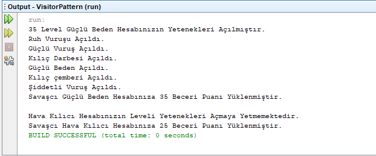

= [black]#VISITOR TASARIM DESENİ#

[gray]#Onur Kaplan - 160202061#

Visitor tasarım deseni işlem yapılacak nesnelerde herhangi bir değişiklik yapmadan sonradan modüler olarak metodlar eklememizi sağlar. Eğer sisteme yeni nesneler yerine yeni işlemlerin eklenmesi gerekiyorsa bu desen tercih edilebilir. Sınıfın olmayan özelliğini sonradan eklemeyi kolaylaştırır.

Örnek uygulamada bir oyun sistemi oluşturdum. Karakter arayüzünden türetilmiş karakterlerin türlerine ve levellerine göre sonradan yetenek ve beceri puanı ekleneceği için visitor patterni tercih ettim.

Visitor : Her nesne yapısında Concrete Element için visit methodunu tanımlar.

ConcreteVisitor : Visitor tarafından tanımlanan her methodu implemente eder.

Element : Parametre olarak visitorun alındığı methodu implemente eder.

ConcreteElement : Parametre olarak visitorun alındığı methodu implemente eder.

ObjectStructure : Elemanlar için sıralama sağlar. Visitorun elemanlarına high-level interface sağlar.

=== [black]#UML#

.Visitor Pattern UML
[uml,file="umlClass1.png"]
----

class VisitorPattern {
+{static} void main()
}

interface KarakterVisitor {
+void visit()
+void visit()
}

class YetenekYükleVisitor{
}

class BeceriYükleVisitor{
}

interface Karakter {
+void yükle()
}

class SavaşcıGüçlüBeden{
+int level
+SavaşcıGüçlüBeden()
+int getlevel()
}

class SavaşcıHavaKılıcı{
+int level
+SavaşcıHavaKılıcı()
+int getlevel()
}

YetenekYükleVisitor ..|> KarakterVisitor
BeceriYükleVisitor ..|> KarakterVisitor
SavaşcıGüçlüBeden ..|> Karakter
SavaşcıHavaKılıcı ..|> Karakter
VisitorPattern ..> KarakterVisitor : <<use>>
VisitorPattern ..> Karakter : <<use>>

----

.VisitorPattern.java
[source,java]
----

package visitorpattern;

public class VisitorPattern {

    public static void main(String[] args) {
        // TODO code application logic here
        Karakter savaşcıgb = new SavaşcıGüçlüBeden(35);
        Karakter savaşcıhk = new SavaşcıHavaKılıcı(25);
        
        KarakterVisitor yenetekvisitor = new YetenekYükleVisitor();
        KarakterVisitor becerivisitor = new BeceriYükleVisitor();
        
        savaşcıgb.yükle(yenetekvisitor);
        savaşcıgb.yükle(becerivisitor);
        System.out.println("");
        savaşcıhk.yükle(yenetekvisitor);
        savaşcıhk.yükle(becerivisitor);
               
    }
    
}

----

.KarakterVisitor.java
[source,java]
----

package visitorpattern;
//Visitor
public interface KarakterVisitor { <1>
    void visit(SavaşcıGüçlüBeden savaşcıgb);
    void visit(SavaşcıHavaKılıcı savaşcıhk); 
}

----

<1> Eklenilecek bütün özellikler için bir arayüz oluşturulur.

.YetenekYükleVisitor.java
[source,java]
----

package visitorpattern;
//ConcreteVisitor
public class YetenekYükleVisitor implements KarakterVisitor{

    @Override
    public void visit(SavaşcıGüçlüBeden savaşcıgb) {
         if(savaşcıgb.getlevel() >= 30){
            System.out.println(savaşcıgb.getlevel() + " Level Güçlü Beden Hesabınızın Yetenekleri Açılmıştır.");
            System.out.println("Ruh Vuruşu Açıldı.");
            System.out.println("Güçlü Vuruş Açıldı.");
            System.out.println("Kılıç Darbesi Açıldı.");
            System.out.println("Güçlü Beden Açıldı.");
            System.out.println("Kılıç çemberi Açıldı.");
            System.out.println("Şiddetli Vuruş Açıldı.");
        }else{
            System.out.println("Güçlü Beden Hesabınızın Levelini Yetenekleri Açmaya Yetmemektedir.");
        }
    }

    @Override
    public void visit(SavaşcıHavaKılıcı savaşcıhk) {
        if(savaşcıhk.getlevel() >= 30){
            System.out.println(savaşcıhk.getlevel() + "Level Hava Kılıcı Hesabınızın Yetenekleri Açılmıştır.");
            System.out.println("Hava Kılıcı Açıldı.");
            System.out.println("Öfke Açıldı.");
            System.out.println("Üç Yönlü Kesme Açıldı.");
            System.out.println("Hamle Açıldı.");
            System.out.println("Kılıç çevirme Açıldı.");
            System.out.println("Yaşama İsteği Açıldı.");
        }else{
            System.out.println("Hava Kılıcı Hesabınızın Leveli Yetenekleri Açmaya Yetmemektedir.");
        }
    }
    
}

----

.BeceriYükleVisitor.java
[source,java]
----

package visitorpattern;
//ConcreteVisitor
public class BeceriYükleVisitor implements KarakterVisitor{

    @Override
    public void visit(SavaşcıGüçlüBeden savaşcıgb) {
        System.out.println("Savaşcı Güçlü Beden Hesabınıza " + savaşcıgb.getlevel() + " Beceri Puanı Yüklenmiştir.");
    }

    @Override
    public void visit(SavaşcıHavaKılıcı savaşcıhk) {
        System.out.println("Savaşcı Hava Kılıcı Hesabınıza " + savaşcıhk.getlevel() + " Beceri Puanı Yüklenmiştir.");
    }
    
}

----

.Karakter.java
[source,java]
----

package visitorpattern;
//Element
public interface Karakter { <1>
    void yükle(KarakterVisitor karaktervisitor);
}

----

<1> Nesneye yeni özelliklerin eklenmesi için yükleme arayüzü oluşturur.

.SavaşcıGüçlüBeden.java
[source,java]
----

package visitorpattern;
//ConcreteElement
public class SavaşcıGüçlüBeden implements Karakter{

    public int level;
    
    public SavaşcıGüçlüBeden(int level){
        this.level = level; 
    }
            
    public int getlevel() {
        return level;
    }

    @Override
    public void yükle(KarakterVisitor karaktervisitor) {
        karaktervisitor.visit(this);
    }  
}

----

.SavaşcıHavaKılıcı.java
[source,java]
----

package visitorpattern;
//ConcreteElement
public class SavaşcıHavaKılıcı implements Karakter {

    public int level;
    
    public SavaşcıHavaKılıcı(int level){
        this.level = level; 
    }
            
    public int getlevel() {
        return level;
    }
    
    @Override
    public void yükle(KarakterVisitor karaktervisitor) {
        karaktervisitor.visit(this);
    }    
}

----

=== [black]#SONUÇLAR#

Karakterleri oluşturduktan sonra visitorları kullanarak yükle() methodu ile yetenek ve becerilerini yükledim. 
